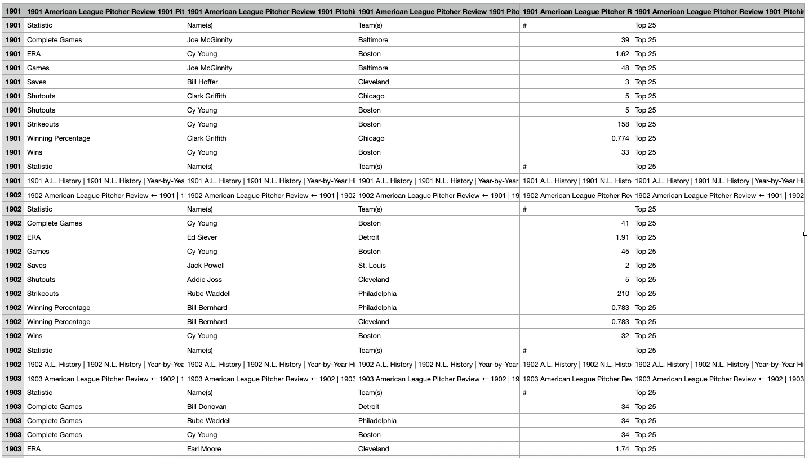

# Major League Baseball History Web Scrapping Project

## How to install
1. Make sure Python is installed.
2. Run `python3 -m venv .venv` to create virtual env.
3. Run `source .venv/bin/activate` to activate virtual env.
4. Run `pip install -r requirements.txt` to install all dependencies.
5. Run `python BaseballHistoryScraper.py` to parse the Major League Baseball History Website into csv files into [scraped_data](scraped_data) folder.
6. Run `python csv_cleanup_players.py` to clean up both [American_League_Pitcher_Review.csv](scraped_data/American_League_Pitcher_Review.csv) and [American_League_Player_Review.csv](scraped_data/American_League_Player_Review.csv) csv files. This will create "*_cleaned.csv" files inside [cleaned_data](cleaned_data) folder.
7. Run `python db/import_to_sqlite.py` to import csv files into SQLite.
8. Run `python db/database_query.py` to query the database via the command line.
9. Run `streamlit run streamlit/baseball_players.py` to see Streamlit dashboard with players/pitchers insights.

## Data before and after

One can see raw parsed data inside [scraped_data](scraped_data) folder and cleaned data inside [cleaned_data](cleaned_data) folder.

E.g.: [American_League_Pitcher_Review.csv](scraped_data/American_League_Pitcher_Review.csv) before:

and after clean up:

## Importer to DB

After import here is data in DB:

## Query db via command line

## Streamlit dashboard
 
> I'm not a Baseball guru. TBH, I don't know anything about this game, so my understanding of data is limited.
That's why I tried to show data to the user in that way, so they could see insights from their knowledge.

This dashboard is [deployed to Render](https://major-league-baseball-history-web.onrender.com).

By default, Dataset isset to Pitching, all years are selected and Strikeouts is the main statistics:

All filters are multiselect.

When the only one Statistic Name is selected, there is one additional figure - a line plot with average stats over time:

I added some insight from the stats over time:

Also, there is another figure with TOP players/pitchers:

One can change dataset and observe Hitting stats for players:

Also, there is an option to filter by player:

## TODO
As the amount of data is huge and time is limited, there are a couple of things I want to do in the future:
- Clean up and merge parsed Team stat csv files.
- Figure out how baseball works and what does baseball statistics meaning more details to add more insight.
- Update Streamlit dashboard with more figures.
